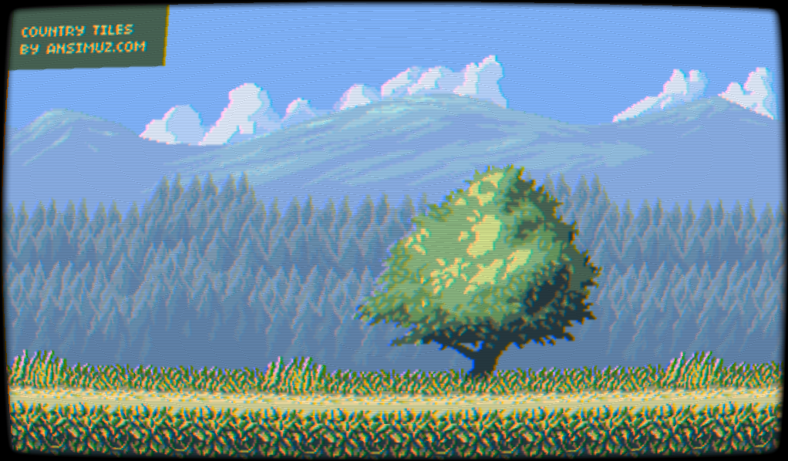

# SimpleGodotCRTShader
A simple Godot (v2.x and v3.x) shader that simulates CRT Displays.

# How to install

**Compatibility**: Thank you MohabMohamed for porting the Shader to Godot 3.x! Both projects can be found on their respective folders. To test, remember to change the variable values on the shader script.

## For Godot 2.x

You can use the shader by just copying the "CRTDisplayShader.shd" to your project (it's the Shader raw code). But if you don't know how to setup the shader material, you can just use the CRTViewportDisplay:

1. Copy-paste the "CRTViewportDisplay" folder to your project.
2. Open the "CRT.scn" on Godot Editor, and set the correct size of the viewport and the frames for your project display size.
3. Add the main scene of your project as a child of the Viewport node.

The viewport will than render your project using the CRT Shader.

You can modify the values of the Shader using the Uniform Variables.

A tutorial on how to install the Shader (YouTube): [https://www.youtube.com/watch?v=ydrC-3Uy-aY&feature=youtu.be](https://www.youtube.com/watch?v=ydrC-3Uy-aY&feature=youtu.be)

# How the Shader works
This Shader is made of 3 main components:

* Distortion: It is the effect that causes the '3D'-like monitor effect.
* Color Bleeding: Creates a small 'color bleeding' on the Red and Blue channel of close pixels.
* Scanlines: Creates a strip of black, alpha lines that moves constantly on the screen.

All the effects have Uniform variables, so they can be controlled without changing the code.

The effects are based on these articles:

* Distortion: http://www.geeks3d.com/20140213/glsl-shader-library-fish-eye-and-dome-and-barrel-distortion-post-processing-filters/2/
* Color Bleeding and Scanlines: http://www.magneticrealms.com/posts/2014/02/03/a-crt-filter-without-shaders/

A shoutout for the Godot developpers group on facebook! I would be completely lost without you guys, haha.

The screen sample was made by 'ansimuz' - the art is in public domain (CC0), and can be found in: http://opengameart.org/content/country-side-platform-tiles.
