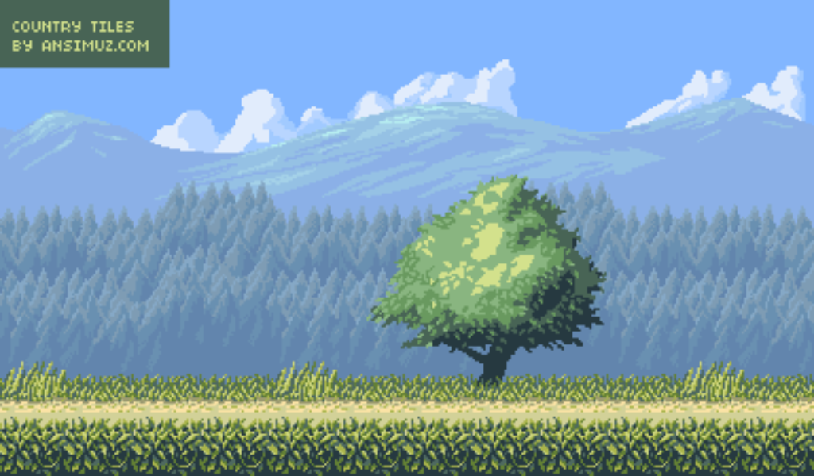

# SimpleGodotCRTShader
A simple Godot shader that simulates CRT Displays.

# How to install
Just clone the git repository and open the project using Godot.

There are too 'main' scenes on the project: one of them is a Texture Shader ("ShaderTest.scn"), and the other one is a Display Shader ("ShaderTestsScreen.scn"). Both have the same type of shader implemented, but one of them get the UV's and colors directly from the texture, and the other one actually get the information from the display.

# How the Shader works
This Shader is made of 3 main components:

* Distortion: It is the effect that causes the '3D'-like monitor effect.
* Color Bleeding: Creates a small 'color bleeding' on the Red and Blue channel of close pixels.
* Scanlines: Creates a strip of black, alpha lines that moves constantly on the screen.

All the effects have Uniform variables, so they can be controlled without changing the code.

The effects are based on these articles:

* Distortion: http://www.geeks3d.com/20140213/glsl-shader-library-fish-eye-and-dome-and-barrel-distortion-post-processing-filters/2/
* Color Bleeding and Scanlines: http://www.magneticrealms.com/posts/2014/02/03/a-crt-filter-without-shaders/

A shoutout for the Godot developpers group on facebook! I would be completely lost without you guys, haha.

The screen sample was made by 'ansimuz' - the art is in public domain (CC0), and can be found in: http://opengameart.org/content/country-side-platform-tiles.
